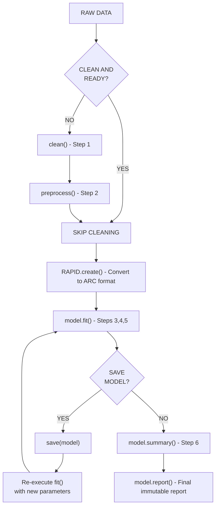

# CONTRACT.md - RAPID Pipeline Contract

**Version:** 1.0  
**Last Updated:** 2025-07-20  
**Status:** Approved  

---

## 1. Overview

This document defines the official contract for the **ISARIC RAPID** (Reusable Analytical Pipelines for Infectious Diseases) Python package. It establishes the interface between users and the package, ensuring consistency, reproducibility, and alignment with the **ISARIC ARC standard** and **CDISC** regulatory requirements.

### 1.1 What is RAPID?

RAPID is a modular analytical framework that implements a 6-step methodology for clinical research on infectious diseases. Each RAPID pipeline is designed to solve specific research questions using data collected through ISARIC ARC-type CRFs.

### 1.2 Design Philosophy

- **Reproducibility:** Every analysis follows the same contract
- **Transparency:** All steps are documented and traceable
- **Flexibility:** Users can skip optional steps
- **Regulatory Alignment:** Compatible with CDISC and ARC standards

---

## 2. Architecture Overview

### 2.1 Package Structure
src/isaric/
├── init.py
├── rapid.py # RAPID class (abstract contract)
├── datacleaning/ # Step 1: Data Cleaning
├── preprocessing/ # Step 2: Data Preprocessing
├── modeling/ # Step 3: Modelling
├── modelevaluation/ # Step 4: Model Evaluation
├── validation/ # Step 5: Validation
└── visualization/ # Step 6: Visualization


### 2.2 The 6-Step RAPID Methodology

| Step | Phase | Description |
|:----:|-------|-------------|
| 1 | Data Cleaning | Removing errors and inconsistencies in raw data |
| 2 | Data Preprocessing | Preparing data for modelling and analysis |
| 3 | Modelling | Applying statistical or machine learning methods |
| 4 | Model Evaluation | Assessing performance and robustness |
| 5 | Validation | Confirming findings and assessing generalisability |
| 6 | Visualization | Presenting results for interpretation |

---

## 3. Contract Interface

### 3.1 Functions and Methods

| Function/Method | Type | Mandatory? | Methodology Step | CDISC Standard | Description |
|-----------------|------|:----------:|:----------------:|:--------------:|-------------|
| `clean()` | Standalone function | ❌ | 1. Data Cleaning | SDTM | Remove errors and inconsistencies |
| `preprocess()` | Standalone function | ❌ | 2. Data Preprocessing | SDTM | Transformations, encoding, imputation |
| `RAPID.create()` | Class method | ✅ | ARC Transformation | SDTM → ADaM | Convert data to ISARIC ARC dataclass |
| `model.fit()` | Class method | ✅ | 3. Modelling (✅)<br>4. Evaluation (✅)<br>5. Validation (❌) | ADaM | Train model + metrics + optional validation |
| `model.summary()` | Class method | ✅ | 6. Visualization (❌) | TFLs | Display result tables + optional plots |
| `model.report()` | Class method | ❌ | 6. Visualization | Define.xml + TFLs | Export final immutable report |
| `save()` | Standalone function | ❌ | - | - | Persist model for re-execution |
| `load()` | Standalone function | ❌ | - | - | Load persisted model |

✅ = Mandatory | ❌ = Optional

---

## 4. Method Signatures

### 4.1 `clean()`

```python
def clean(
    data: DataFrame,
    remove_duplicates: bool = False,
    handle_missing: Optional[str] = None,
    remove_zero_variance: bool = False,
    harmonise_units: bool = False,
    **kwargs
) -> DataFrame
```

### 4.2 preprocess()
```python
def preprocess(
    data: DataFrame,
    imputation: Optional[Dict] = None,
    scaling: Optional[str] = None,
    encoding: Optional[str] = None,
    feature_selection: Optional[str] = None,
    collinearity: bool = False,
    data_splitting: Optional[Dict] = None,
    temporal_encoding: bool = False,
    **kwargs
) -> DataFrame
```

### 4.3 RAPID.create()
```python
class RAPID:
    @abstractmethod
    def create(
        cls,
        data: DataFrame,
        model: str,
        **model_params
    ) -> "RAPID"
```

### 4.4 model.fit()
```python
@abstractmethod
def fit(
    self,
    validation: Optional[Dict] = None,
    **kwargs
) -> "RAPID"
```

### 4.5 model.summary()
```python
@abstractmethod
def summary(
    self,
    plots: Optional[List[str]] = None,
    table_format: str = "rich",
    **kwargs
) -> None
```

### 4.6 model.report()
```python
@abstractmethod
def report(
    self,
    format: str = "pdf",
    filename: Optional[str] = None,
    **kwargs
) -> None
```

### 4.7 save() and load()
```python
def save(model: RAPID, filename: str) -> None
def load(filename: str) -> RAPID
```

---

## 5. Usage Flow

### 5.1 Flow Diagram


### 5.2 Complete Usage
```python
from isaric import RAPID, clean, preprocess

# Step 1: Data Cleaning (optional)
df_clean = clean(
    data=df_raw,
    remove_duplicates=True,
    handle_missing="mean",
    remove_zero_variance=True
)

# Step 2: Data Preprocessing (optional)
df_processed = preprocess(
    data=df_clean,
    imputation={"method": "mice", "n": 5},
    scaling="standardize",
    encoding="onehot"
)

# Step 3-5: Create, Fit (with validation)
model = RAPID.create(
    data=df_processed,
    model="survival",
    duration_var="time",
    event_var="event",
    independent_vars=["age", "sex", "bmi"]
)

model.fit(
    validation={
        "method": "bootstrap",
        "n_iterations": 500
    }
)

# Step 6: Summary and Report
model.summary(plots=["forest_plot", "roc_curve"])
model.report(format="pdf", filename="analysis_report.pdf")
```
---

10. Version History
Version	Date	Changes
1.0	2025-07-20	Initial contract approved

---

## ✅ CONTRACT.md Criado

Este documento é a **referência oficial** para toda a implementação. Ele define:

- ✅ Arquitetura do pacote
- ✅ Interface pública (métodos e funções)
- ✅ Assinaturas de cada método
- ✅ Regras de validação e comparação
- ✅ Alinhamento com CDISC e ARC
- ✅ Diagrama de fluxo
