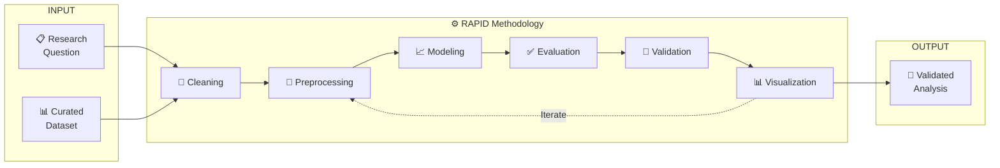
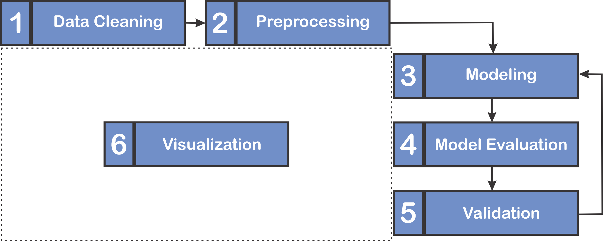

# 🌟 ISARIC Clinical Epidemiology Platform

## RAPID Methodology: Reusable Analytical Pipelines for Infectious Diseases

Welcome to the official documentation for the **RAPID Methodology** (Reusable Analytical Pipelines for Infectious Diseases).

RAPID is a robust analytical structure, adapted by ISARIC, which integrates software engineering principles to formalize and standardize the entire analytical workflow in clinical research concerning infectious diseases.

Our core objective is to ensure that analyses are **Reproducible, Transparent, Efficient, and Robust**.

---

## 🔄 The RAPID Methodology Flow
The RAPID methodology transforms a clinical research question and a curated dataset into a transparent and validated analysis with clinical relevance.


---

## 📖 The 6-Step RAPID Workflow



| Step | Phase | Mandatory | Description |
|:----:|-------|:---------:|-------------|
| 1 | 🧹 **Cleaning** | ❌ | Remove outliers, handle duplicates, standardize formats |
| 2 | 📐 **Preprocessing** | ✅ | MICE imputation, encoding, normalization |
| 3 | 📈 **Modeling** | ✅ | Apply statistical models (GLM, Survival, MICE) |
| 4 | ✅ **Evaluation** | ✅ | Performance metrics, concordance index, Brier score |
| 5 | 🔬 **Validation** | ✅ | Bootstrapping, cross-validation |
| 6 | 📊 **Visualization** | ❌ | Survival curves, forest plots, hazard ratios |

!!! info "Iterative Process"
    Visualization can occur at any stage. The dashed arrows indicate that researchers may return to previous steps to refine the model based on evaluation results.

### 📄 Full Methodology Document

For complete details on the RAPID methodology, including theoretical foundations and design decisions:

📥 **[Download the RAPID Methodology (PDF)](assets/methodology_v01.pdf){:target="_blank"}**

---

## 🚀 Start Your Analysis

### 📦 Installation

Install the RAPID package directly from GitHub:

```bash
pip install git+https://github.com/noispuc/isaric3.0-rapid.git
```

For detailed instructions and alternative methods, see the **[Installation Guide](getting_started/installation.md)**

### 📚 Choose Your Path

| You want to... | Go to... |
|----------------|----------|
| Understand why RAPID exists | **[Why RAPID?](getting_started/why_rapid.md)** |
| Get started quickly | **[Quickstart Guide](getting_started/quickstart.md)** |
| Learn statistical theory + practice | **[User Guide](user_guide/guide_logistic.md)** |
| Quick reference (parameters & methods) | **[Quick Guide](quick_guide/quick_logistic.md)** |
| See real-world examples | **[Examples Gallery](examples/)** |

---

## Primary Audience

The RAPID methodology is designed to support two main groups of users:

* **End-users:** Researchers, analysts, and domain experts who apply RAPID tools to generate insights and evidence using established workflows.
* **Contributors and Developers:** Data scientists, software engineers, and technical researchers who seek to extend RAPID's capabilities, including developing new functionalities or refining existing components.

See our **[Contributing Guidelines](contributing.md)** to get involved.

---

## 📬 Contact & Support

- 📧 **Email:** [data@isaric.org](mailto:data@isaric.org)
- 🐙 **GitHub Issues:** [noispuc/isaric3.0-rapid](https://github.com/noispuc/isaric3.0-rapid/issues)
- 🌐 **ISARIC:** [isaric.org](https://isaric.org)