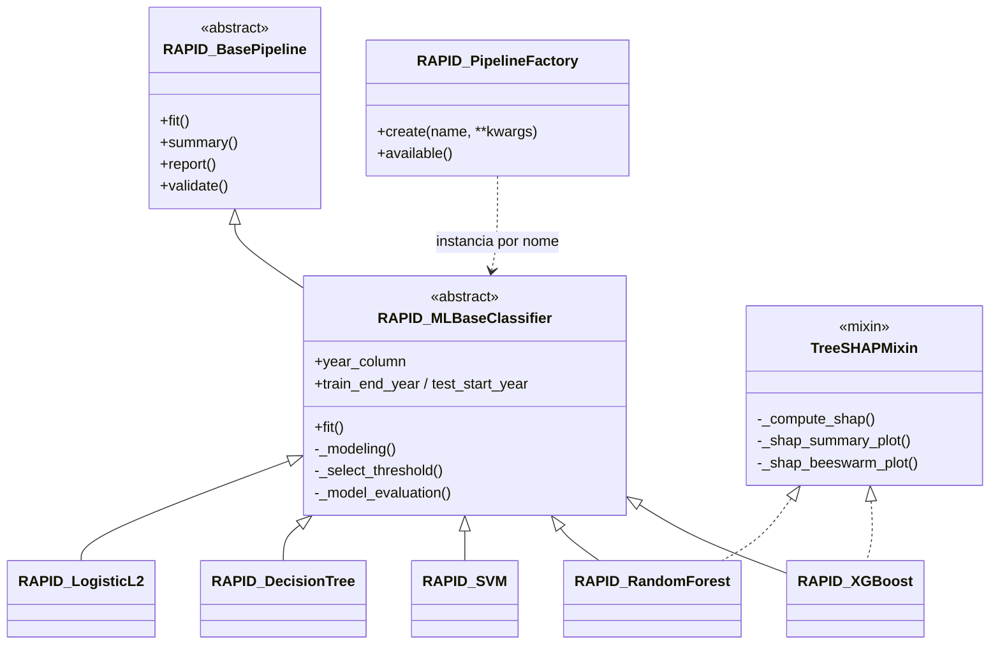
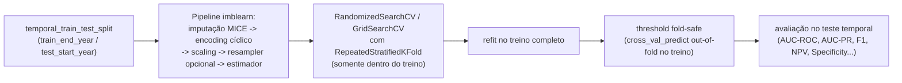

# Plano — Módulo de Modelagem Preditiva (RAPID / ISARIC, arboviroses)

**Status: MVP implementado.** Este documento descreve o escopo, a arquitetura
e as decisões de projeto do pipeline preditivo, e serve como referência para
apresentação ao time.

Contexto: pipeline preditivo para hospitalização em dengue, janela temporal
alvo 2017-2025. Baseado na lógica exploratória de
`temporary/1.analises_iniciais.ipynb` e `temporary/2.modelagem.ipynb`,
formalizada dentro da arquitetura Template Method (`RAPID_BasePipeline`) +
Factory (`RAPID_PipelineFactory`) já usada pelo restante do pacote `isaric`.

---

## 1. Visão geral da arquitetura



Todos os cinco classificadores preditivos (`RAPID_LogisticL2`,
`RAPID_DecisionTree`, `RAPID_RandomForest`, `RAPID_SVM`, `RAPID_XGBoost`)
vivem em um único arquivo, `src/isaric/modeling/predictive_classifier.py`,
porque compartilham exatamente o mesmo Template Method — a única diferença
entre eles é o estimador sklearn/XGBoost e a grade de hiperparâmetros.

**Fluxo de `fit()`** (dentro de `RAPID_MLBaseClassifier._modeling`):



O ponto central de desenho: **nenhum passo depende do conjunto de teste**
antes da avaliação final em F — nem a imputação, nem o scaling, nem o SMOTE
opcional, nem a busca de hiperparâmetros, nem a escolha do threshold.

---

## 2. Como usar

```python
from isaric.modeling.pipeline_factory import RAPID_PipelineFactory

factory = RAPID_PipelineFactory()
print(factory.available())
# ['glm', 'logistic', 'survival', 'lca',
#  'logistic_l2', 'decision_tree', 'random_forest', 'svm', 'xgboost']

model = factory.create(
    "xgboost",
    data=df,                                  # qualquer DataFrame
    dependent_var="hospitalized",             # já codificado 0/1
    independent_vars=["idade", "febre", ...], # numéricos/binários
    year_column="ano_sin_pri",
    train_end_year=2022,
    test_start_year=2023,
    date_column="DT_SIN_PRI",                 # opcional (encoding cíclico de mês)
    epiweek_column="SEM_PRI",                 # opcional (encoding cíclico de semana epi)
)
model.fit()
model.summary(performance="all", collinearity="all", plots=["shap_summary", "shap_beeswarm"])
```

**Notebook completo e independente de dataset** (gera dados sintéticos, não
depende de nenhum arquivo específico):
[`docs/examples/predictive_classifier_example.ipynb`](../../../docs/examples/predictive_classifier_example.ipynb).
Para usar com uma base real, basta trocar o `DataFrame` e os nomes de coluna —
ver a seção 9 do notebook para o checklist completo.

---

## 3. Status de implementação (visão rápida)

Mapeamento item a item contra os 5 blocos do protocolo original.

### 3.1 Modelos

| Item | Status |
|---|---|
| Logistic Regression (L2), Decision Tree, Random Forest, SVM, XGBoost | ✅ Implementado |
| LightGBM, CatBoost | ❌ Iteração 2 |
| LASSO, Elastic Net (hoje só L2/Ridge) | ❌ Iteração 2 |

### 3.2 Métricas

| Item | Status |
|---|---|
| AUC-PR | ✅ Implementado |
| NPV / Specificity | ✅ Implementado |
| AUC-ROC, F1, Precision, Recall, Brier | ✅ Mantido |
| Curva de calibração | ⚠️ Já existe no repo (`calibration.py`/`calibrationplot.py`), mas não conectada ao pipeline novo |
| Calibration-in-the-large / slope / belts | ❌ Iteração 2 |
| Decision Curve Analysis (DCA) | ❌ Iteração 2 |
| IC95% via bootstrap para todas as métricas | ❌ Iteração 2 |

### 3.3 Validação

| Item | Status |
|---|---|
| Split temporal (treino em anos anteriores, teste em posteriores) | ✅ Implementado |
| K-fold CV repetido dentro do bloco de treino | ✅ Implementado |

### 3.4 Pré-processamento

| Item | Status |
|---|---|
| Imputação MICE principal + mediana/moda como sensibilidade | ✅ Implementado |
| Encoding cíclico (seno/cosseno) para mês e semana epidemiológica | ✅ Implementado |
| VIF + correlação para colinearidade antes do fit | ✅ Implementado (diagnóstico, não remove nada) |
| `class_weight='balanced'` (LR/DT/RF/SVM) | ✅ Implementado |
| `scale_pos_weight` (XGBoost), recalculado por fold | ✅ Implementado |
| SMOTE/undersampling só como sensibilidade, dentro dos folds | ✅ Implementado |

### 3.5 Interpretabilidade

| Item | Status |
|---|---|
| SHAP — XGBoost | ✅ Implementado |
| SHAP — Random Forest | ✅ Implementado |
| SHAP — LightGBM | ❌ N/A (LightGBM não implementado) |
| SHAP — Decision Tree, SVM, LR | ❌ Iteração 2 |

---

## 4. Escopo do MVP — detalhes de implementação

### 4.1 Validação temporal (prioridade máxima) ✅
- `train_test_split` aleatório substituído por split temporal parametrizado
  (`train_end_year` / `test_start_year`) — `temporal_train_test_split`.
- `RepeatedStratifiedKFold` dentro do bloco de treino para tuning de
  hiperparâmetros — `build_repeated_stratified_kfold`.
- Todo pré-processamento dentro de um `Pipeline` (via `imbalanced-learn`)
  ajustado somente no treino — sem vazamento de informação do teste.
- **Caveat conhecido**: em `data/df_tratado.parquet`, `ano_sin_pri` está
  concentrado em 2019 (834.482 de 839.571 linhas). A execução ponta a ponta
  do MVP validou a *mecânica* do split (ausência de vazamento) com esses
  dados, não um benchmark multi-ano representativo — isso só é possível
  quando a base 2017-2025 completa for carregada (ver item de iteração 2).

### 4.2 Pré-processamento ✅
- Imputação MICE via `sklearn.impute.IterativeImputer` (principal), com
  mediana/moda como sensibilidade parametrizável — `build_imputer`.
- Guarda de missingness: descarta colunas acima de `max_missing_frac`
  (default 0.95) antes de imputar, com erro explícito se um preditor pedido
  for descartado — `drop_high_missingness_columns`.
- Encoding cíclico (seno/cosseno) para mês e semana epidemiológica —
  `CyclicalFeatureEncoder`, testado para as propriedades matemáticas do
  círculo (periodicidade, continuidade dez→jan).
- Checagem de colinearidade antes do fit: VIF + matriz de correlação,
  relatório apenas (sem remoção automática) — `collinearity_report`.
- Desbalanceamento (alvo raro, ≈ 4.9% positivo no dataset de referência):
  - `class_weight='balanced'` para Regressão Logística L2, Decision Tree,
    Random Forest, SVM — recalculado automaticamente pelo sklearn a cada
    `.fit()` de fold, portanto já fold-safe.
  - `scale_pos_weight` recalculado por fold para XGBoost —
    `_AutoScalePosWeightXGBClassifier`.
  - SMOTE/undersampling **apenas como sensibilidade**
    (`imbalance_strategy="smote"|"undersample"`), via `imblearn.pipeline.Pipeline`,
    aplicado exclusivamente dentro dos folds de treino.
- Seleção de threshold de classificação fold-safe (out-of-fold no treino,
  nunca no teste) — `select_classification_threshold`. Necessária porque,
  com prevalência ≈ 4.9%, o corte padrão de 0.5 torna
  Precision/Recall/F1/NPV/Specificity pouco informativos (mesmo problema que
  `encontrar_cutoff` resolvia no notebook 2).

### 4.3 Métricas de discriminação ✅
Adicionadas às já existentes (AUC-ROC, F1, Precision, Recall, Brier):
- AUC-PR (essencial dado o desbalanceamento).
- NPV e Specificity.
— `compute_extended_classification_metrics`.

**Nota — curva de calibração**: o repositório já tinha `modelevaluation/calibration.py`
e `visualization/calibrationplot.py` de antes desta rodada, mas eles **não foram
conectados** a `predictive_classifier.py` — `summary()`/`report()` dos 5 modelos
novos não geram curva de calibração. Ficou fora por não estar no escopo
explícito do MVP (que só pedia AUC-PR/NPV/Specificity); calibration-in-the-large,
slope e belts (esses sim já fora de escopo desde o início) estão listados na
seção 5.

### 4.4 Interpretabilidade ✅
- SHAP (`shap.TreeExplainer`) para os modelos baseados em árvore — **apenas
  Random Forest e XGBoost** (Decision Tree fica de fora do escopo do SHAP
  nesta rodada) — `TreeSHAPMixin`.
- Summary plot e beeswarm, salvos como artefatos PNG — `SHAPPlots`.

### 4.5 Arquivos tocados/criados
| Arquivo | Mudança |
|---|---|
| `src/isaric/modeling/predictive_classifier.py` (novo) | `RAPID_MLBaseClassifier` + `TreeSHAPMixin` + `RAPID_LogisticL2`, `RAPID_DecisionTree`, `RAPID_RandomForest`, `RAPID_SVM`, `RAPID_XGBoost` — todos no mesmo arquivo |
| `src/isaric/modeling/pipeline_factory.py` | registra `'logistic_l2'`, `'decision_tree'`, `'random_forest'`, `'svm'`, `'xgboost'` |
| `src/isaric/preprocessing/datasplitting.py` | `temporal_train_test_split(df, year_column, train_end_year, test_start_year)` |
| `src/isaric/preprocessing/temporalencoding.py` | `CyclicalFeatureEncoder` (mês / semana epidemiológica) |
| `src/isaric/preprocessing/imputation.py` | `build_imputer`, `drop_high_missingness_columns` |
| `src/isaric/preprocessing/collinearity.py` | `collinearity_report(X, corr_threshold, vif_threshold)` |
| `src/isaric/modelevaluation/crossvalidation.py` | `build_repeated_stratified_kfold` |
| `src/isaric/modelevaluation/metrics.py` | `compute_extended_classification_metrics`, `select_classification_threshold` |
| `src/isaric/visualization/shapplots.py` (novo) | `SHAPPlots.summary_plot` / `.beeswarm_plot` |
| `docs/examples/predictive_classifier_example.ipynb` (novo) | tutorial completo, dados sintéticos (independente de dataset) |
| `tests/test_datasplitting.py` (novo) | ausência de vazamento temporal (6 testes) |
| `tests/test_temporalencoding.py` (novo) | propriedades do encoding cíclico (7 testes) |
| `pyproject.toml`, `requirements.txt` | `xgboost`, `shap`, `imbalanced-learn`, `pyarrow`, `pytest` (dev) |

Todos os módulos/funções existentes (`fit_random_forest`, `fit_linear_regression`,
`split_data`, `MICEImputer`, `detect_collinearity`, `compute_classification_metrics`,
etc.) permanecem intocados — nada foi renomeado ou reorganizado nesta rodada.

Um import circular pré-existente entre `preprocessing.collinearity` e
`modeling` (via `modelevaluation`) foi exposto por essa mudança e corrigido
tornando um import local à função (`collinearity_report`), sem reorganizar
nenhum módulo.

### 4.6 Ordem de execução (todas as etapas concluídas)
1. ✅ Dependências + scaffold de `tests/`
2. ✅ Validação temporal (`datasplitting.py` + testes)
3. ✅ Encoding cíclico (`temporalencoding.py` + testes)
4. ✅ `predictive_classifier.py` completo (base + 5 subclasses, imputação com
   guarda de missing, colinearidade, desbalanceamento, threshold fold-safe)
5. ✅ Métricas estendidas integradas
6. ✅ SHAP (RF/XGBoost)
7. ✅ Registro na factory
8. ✅ Execução ponta a ponta com `data/df_tratado.parquet` (alvo `HOSPITALIZ`,
   preditores replicando sintomas/comorbidades/alarme do notebook 2) — AUC-ROC
   entre 0.66 (XGBoost) e 0.75 (Logistic L2) no teste temporal amostrado; ver
   também os testes automatizados (13/13 passando) e o notebook de exemplo
   para uma execução reprodutível com dados sintéticos.

---

## 5. Iteração 2 (não implementado — próxima rodada)

Itens explicitamente fora do escopo do MVP, marcados como `# TODO(iter2):`
nos respectivos pontos de extensão do código:

- **Modelos**: LightGBM, CatBoost, LASSO, Elastic Net —
  `pipeline_factory.py`.
- **Curva de calibração básica**: conectar `modelevaluation/calibration.py` /
  `visualization/calibrationplot.py` (já existentes no repo) a
  `predictive_classifier.py` — hoje não fazem parte de `summary()`/`report()`
  dos 5 modelos novos (ver nota na seção 4.3).
- **Calibração avançada**: calibration-in-the-large, calibration slope,
  calibration belts (o notebook 2 tem uma seção de `CalibrationDisplay` que
  serve de referência).
- **Decision Curve Analysis (DCA)**.
- **Incerteza**: intervalos de confiança de 95% via bootstrap para AUC e
  demais métricas (o notebook 2 já reporta `AUC IC95%`) —
  `RAPID_MLBaseClassifier.validate()`.
- **Validação temporal multi-ano real**: reavaliar o pipeline quando a base
  2017-2025 completa (não só 2019) estiver disponível — o caveat da seção
  4.1 deixa de existir.
- **Granularidade do split temporal**: hoje parametrizado por ano; avaliar
  necessidade de granularidade mensal para bases concentradas em um único
  ano — `datasplitting.py`.
- **Engenharia de features específica de dengue**: os grupos `sintomas`,
  `comorbidades`, `alarme`, `grave` e variáveis combinadas (`vomito_nausea`,
  `alarm_tds`, `grave_tds`, etc.) do notebook 1/2 continuam fora do pacote
  genérico — decidir se formalizam em um módulo de preparação de dados
  próprio do domínio dengue, fora de `isaric.modeling`.
- **SHAP para Decision Tree e SVM/LR** (interpretabilidade além de
  RF/XGBoost) — `TreeSHAPMixin`.
- **Refinamento da seleção de threshold**: hoje `'f1'`/`'youden'`; avaliar
  custo assimétrico clínico quando a aplicação clínica final for definida —
  `select_classification_threshold`.
